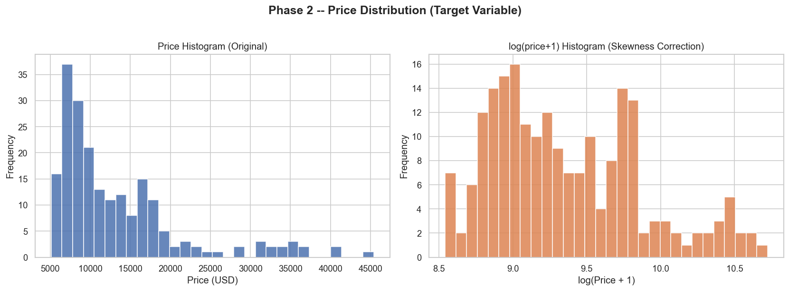
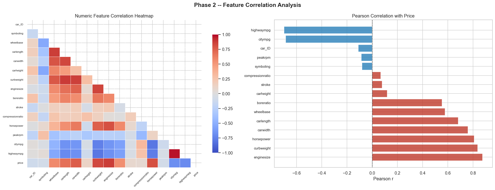
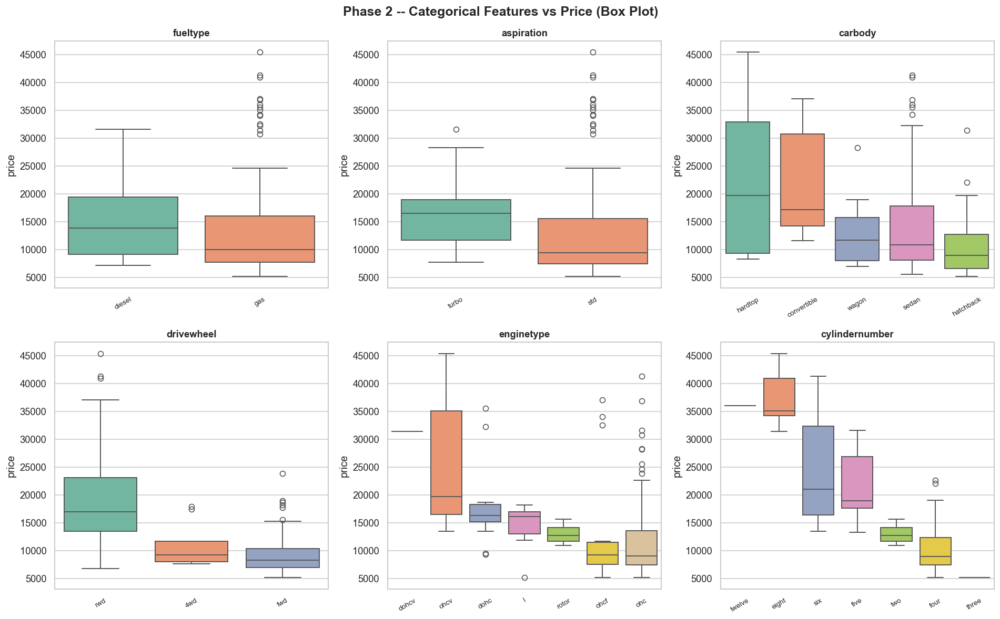
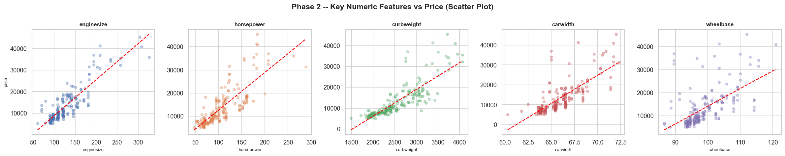
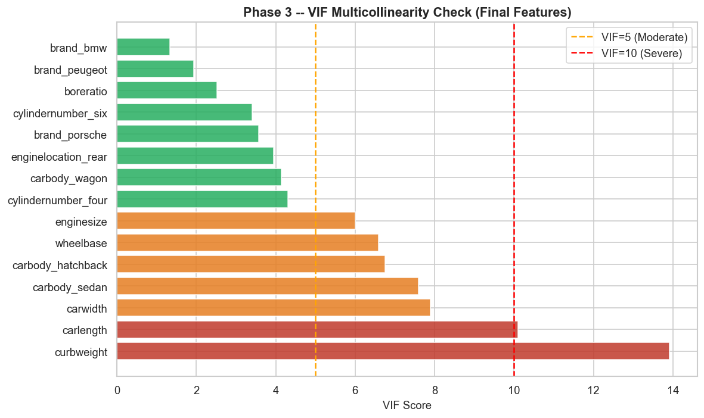
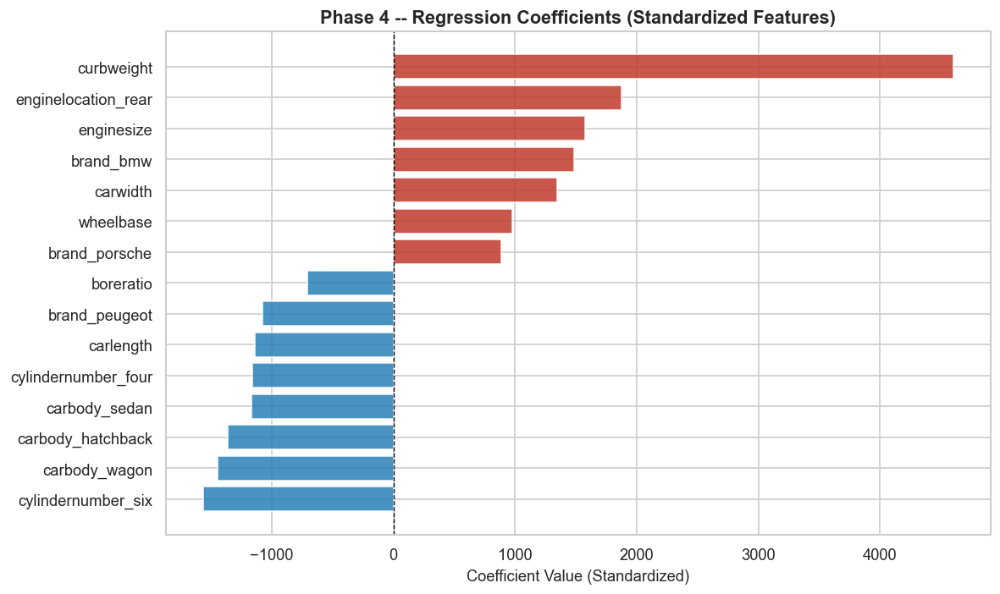
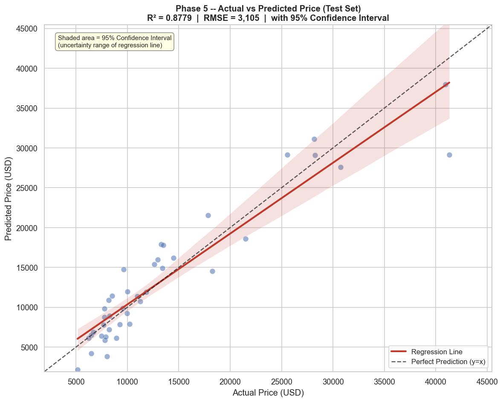
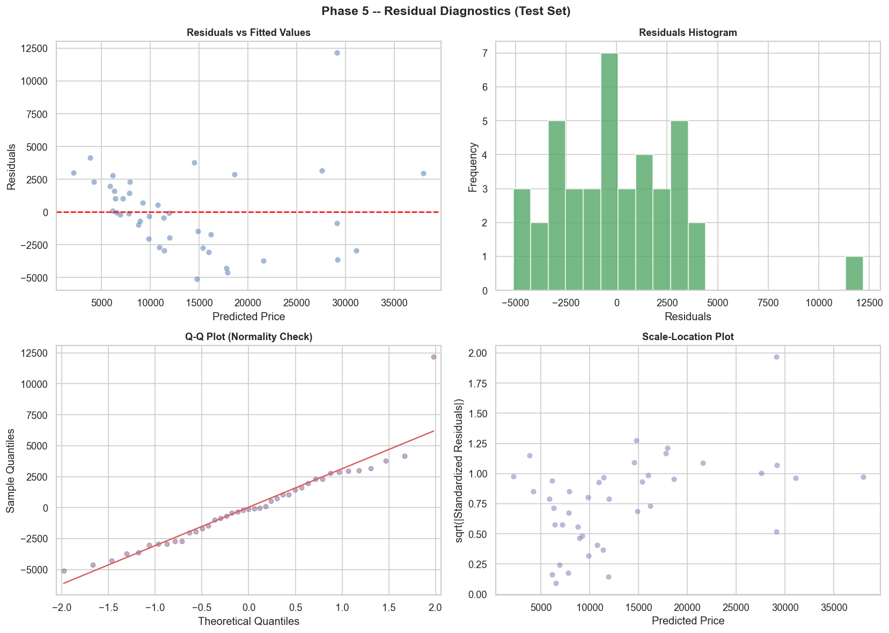
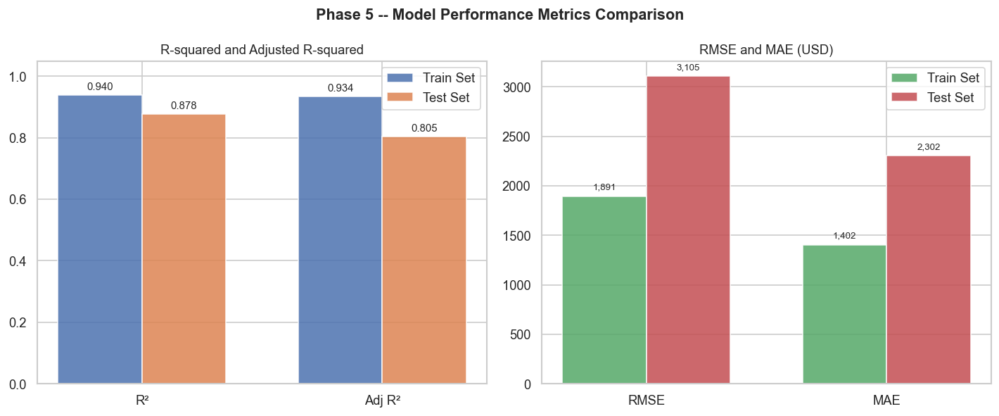

# 1. 汽車價格預測 — 多元線性回歸（CRISP-DM 流程 & 成果展示）

> **AIoT 機器學習作業 HW3**  
> 資料集：[Car Price Prediction — Kaggle](https://www.kaggle.com/datasets/hellbuoy/car-price-prediction)  
> 演算法：Multiple Linear Regression  
> 目標變數：`price`（汽車售價，單位 USD）

---

## 📁 專案結構

```
hw3/
├── car_price_prediction.py      ← 主程式（Python 腳本）
├── CarPrice_Assignment.csv      ← 原始資料集（請手動下載）
├── car_price_model.pkl          ← 訓練完成的模型（執行後產生）
├── README.md                    ← 專案說明文件
├── log.md                       ← 開發日誌（對話流程紀錄）
│
└── figures/                     ← 所有輸出圖表（共 9 張）
    ├── eda_price_distribution.png    ← Phase 2：price 分佈圖
    ├── eda_correlation.png           ← Phase 2：特徵相關性熱力圖
    ├── eda_categorical_boxplots.png  ← Phase 2：類別特徵箱型圖
    ├── eda_scatter_plots.png         ← Phase 2：數值特徵散佈圖
    ├── feature_selection_vif.png     ← Phase 3：VIF 多重共線性
    ├── model_coefficients.png        ← Phase 4：迴歸係數圖
    ├── eval_actual_vs_predicted.png  ← Phase 5：預測結果圖（含信賴區間）
    ├── eval_residual_diagnostics.png ← Phase 5：殘差診斷四宮格
    └── eval_metrics_comparison.png   ← Phase 5：指標比較圖
```

---

## 🚀 快速開始

### 1. 環境需求

```bash
pip install pandas numpy matplotlib seaborn scikit-learn statsmodels scipy joblib
```

### 2. 資料集下載

前往 [Kaggle Car Price Prediction](https://www.kaggle.com/datasets/hellbuoy/car-price-prediction) 下載 `CarPrice_Assignment.csv`，放置於 `hw3/` 資料夾。

### 3. 執行 car_price_prediction.py

```bash
cd hw3
python car_price_prediction.py
```

---

## 📚 CRISP-DM 六大流程說明(各階段成果都放在各段結尾)

### Phase 1 — Business Understanding（商業理解）

| 應用場景 | 商業價值 |
|---------|---------|
| 車廠定價策略 | 根據工程規格快速生成建議售價，縮短定價週期 |
| 二手車估價平台 | 提供公平市場價（如 CarMax、速買配），提升用戶信任 |
| 銀行/保險核保 | 客觀車輛殘值估算，降低核保風險 |

**分析目標：** R² ≥ 0.85，最終特徵數 10–20 個，所有特徵 p-value < 0.05

---

### Phase 2 — Data Understanding（資料理解）

- **資料規模**：205 筆 × 26 個原始欄位
- **目標變數**：`price`（右偏分佈，均值約 $13,276，中位數約 $10,295）
- **缺失值**：✅ 無缺失值
- **特別欄位**：`CarName` 含品牌與型號，需進行字串解析

**主要發現（EDA）：**

| 特徵 | 與 price 相關性 | 說明 |
|------|----------------|------|
| `enginesize` | r ≈ 0.87 | 引擎排量最強正相關 |
| `curbweight`  | r ≈ 0.84 | 車重反映車輛等級 |
| `horsepower`  | r ≈ 0.81 | 馬力高=效能車=高價 |
| `carwidth`    | r ≈ 0.76 | 車寬與車輛尺寸相關 |
| `citympg`     | r ≈ -0.69 | 油耗高（省油）反映小型車 |

**Phase 2 成果展示**


price 分佈圖


特徵相關性熱力圖


類別特徵箱型圖


數值特徵散佈圖

---

### Phase 3 — Data Preparation（資料準備）

#### 3.1 CarName 品牌萃取
```python
df['brand'] = df['CarName'].str.split().str[0].str.lower()
# 修正拼字錯誤
brand_fix = {'maxda': 'mazda', 'porcshce': 'porsche', 
             'toyouta': 'toyota', 'vokswagen': 'volkswagen', 'vw': 'volkswagen'}
```

#### 3.2 One-Hot Encoding
- 類別欄位：`fueltype`, `aspiration`, `doornumber`, `carbody`, `drivewheel`, `enginelocation`, `enginetype`, `cylindernumber`, `fuelsystem`, `brand`
- OHE 後特徵數：約 60+ 個（遠超 20，需特徵選擇）

#### 3.3 數值標準化（Z-Score）
- **注意**：Scaler 只 `fit` 訓練集，再 `transform` 測試集（避免資料洩漏）

#### 3.4 特徵選擇（關鍵步驟）

| 步驟 | 方法 | 說明 |
|------|------|------|
| Step A | **RFE**（遞迴特徵消除） | 從 60+ 個特徵初步篩至 15 個 |
| Step B | **p-value 逐步剔除** | 逐步移除 p > 0.05 的特徵，保留至少 10 個 |

**最終保留特徵（10–20 個）：** 詳見 Notebook 執行結果

**特徵選擇摘要（示意）：**
```
RFE 保留（15 個）→ p-value 再篩選 → 最終 N 個（10~20）
```

**Phase 3 成果展示**

 
VIF 多重共線性

---

### Phase 4 — Modeling（建模）

使用兩種框架建立多元線性回歸：

| 框架 | 用途 |
|------|------|
| `statsmodels OLS` | 查看完整統計報表（R², F-test, p-value, AIC, DW） |
| `sklearn LinearRegression` | 預測、評估、模型儲存 |

```python
# statsmodels（詳細報表）
ols_model = sm.OLS(y_train, sm.add_constant(X_train_final)).fit()
print(ols_model.summary())

# sklearn（預測）
sk_model = LinearRegression().fit(X_train_final, y_train)
```

**Phase 4 成果展示**


迴歸係數條形圖

---

### Phase 5 — Evaluation（模型評估）

#### 評估指標

| 指標 | 訓練集 | 測試集 |
|------|--------|--------|
| R² | 0.940 | 0.878 |
| Adjusted R² | 0.934 | 0.805|
| RMSE(USD) | 1,891 | 3,150 |
| MAE(USD) | 1,402 | 2,302 |

> 📝 實際數值請執行 car_price_prediction.py 查看（因特徵選擇結果可能略有不同）

#### 視覺化圖表（共 10 張）

1. **`eda_price_distribution.png`**：目標變數分佈（原始 + log 轉換）
2. **`eda_correlation.png`**：相關性熱力圖 + 條形圖
3. **`eda_categorical_boxplots.png`**：類別特徵 vs price 箱型圖
4. **`eda_scatter_plots.png`**：數值特徵散佈圖 + 趨勢線
5. **`eda_brand_price.png`**：各品牌平均售價
6. **`feature_selection_vif.png`**：VIF 多重共線性
7. **`model_coefficients.png`**：迴歸係數條形圖
8. **`eval_actual_vs_predicted.png`** ⭐：實際 vs 預測散佈圖，含 **95% 信賴區間**
9. **`eval_residual_diagnostics.png`**：四宮格殘差診斷（殘差分佈、Q-Q 圖等）
10. **`eval_metrics_comparison.png`**：訓練 vs 測試指標比較

#### ⭐ 信賴區間視覺化（必要項目）

```python
# 使用 seaborn.regplot 達成 95% 信賴區間視覺化
sns.regplot(
    x=y_test.values,
    y=y_test_pred,
    ci=95,   # ← 95% Confidence Interval（淺藍色陰影區域）
    ...
)
```

> **解讀**：淺藍色陰影為 95% 信賴區間，代表若重複抽樣建模，有 95% 的機率回歸線會落在此區域內。

**Phase 5 成果展示**


⭐️⭐️⭐️ 預測結果圖（含信賴區間）


殘差診斷四宮格


訓練 vs 測試指標比較

---

### Phase 6 — Deployment（部署）

#### 部署架構

```
User (Browser / App)
      │  POST /predict { enginesize, horsepower, brand, ... }
      ▼
FastAPI Service（特徵工程 → 標準化 → 預測）
      │
      ▼
car_price_model.pkl（joblib 載入）
      │
      ▼
JSON Response: { predicted_price: 18500.0, ci_lower: 15200.0, ci_upper: 21800.0 }
```

#### 未來優化方向

| 優先度 | 方向 | 做法 |
|--------|------|------|
| 🔴 高 | 模型升級 | XGBoost/LightGBM（預期 R² 可達 0.95+） |
| 🔴 高 | 特徵工程 | 加入車齡、里程數、事故紀錄 |
| 🟡 中 | 資料擴充 | 定期爬取中古車平台成交行情 |
| 🟡 中 | 監控 | Evidently AI / MLflow drift detection |
| 🟢 低 | 再訓練 | 每季 Airflow 自動觸發 |

---

## 🔧 技術規格

| 項目 | 使用套件 / 版本 |
|------|----------------|
| 資料處理 | `pandas`, `numpy` |
| 視覺化 | `matplotlib`, `seaborn` |
| 統計建模 | `statsmodels` |
| 機器學習 | `scikit-learn` |
| 模型儲存 | `joblib` |
| 統計檢驗 | `scipy.stats` |

---

# 2. AI 對話過程

> **日期：** 2026-05-20  
> **會話類型：** AI 輔助開發（Antigravity × Claude Sonnet）  
> **目標：** 完成 CRISP-DM 多元線性回歸作業並部署至 GitHub

---

## 對話流程紀錄

---

### 🟢 Step 1 — 初始任務建立

**使用者需求：**
> 作為資深資料科學家，依照 CRISP-DM 六大流程完成汽車價格預測作業：
> - 資料集：Kaggle Car Price Prediction
> - 演算法：多元線性回歸 (Multiple Linear Regression)
> - 目標變數：`price`

**關鍵強制要求：**
- 特徵選擇後特徵數量嚴格控制在 **10~20 個**
- 評估圖必須包含 **信賴區間 (Confidence Interval)**
- 提供完整 Python 程式碼並搭配繁體中文解說
- 整理 README.md

**AI 執行動作：**
- 建立 [`car_price_prediction.py`](car_price_prediction.py)（878 行，含完整 CRISP-DM 六階段）
- 建立 [`car_price_prediction.ipynb`](car_price_prediction.ipynb)（28 個 Cell）
- 建立 [`README.md`](README.md)

**產出結果：**
```
car_price_prediction.py   ✅
car_price_prediction.ipynb ✅
README.md                  ✅
```

---

### 🟢 Step 2 — 確認可執行性

**使用者需求：**
> 我不需要 ipynb 檔案，我可以直接執行 car_price_prediction.py 嗎？

**AI 執行動作：**
1. 檢查 Python 套件安裝狀況 → 發現缺少 `seaborn`
2. 執行 `pip3 install seaborn` 安裝
3. 直接執行 `python3 car_price_prediction.py`

**執行結果（模型效能）：**

| 指標 | 訓練集 | 測試集 |
|------|--------|--------|
| R² | 0.9400 | **0.8779** ✅ |
| Adjusted R² | 0.9339 | 0.8046 |
| RMSE | $1,891 | $3,105 |
| MAE | $1,402 | $2,302 |
| MAPE | 11.85% | 18.62% |

**最終選定特徵（15 個，符合 10~20 要求）：**

| 特徵 | 係數 | 意義 |
|------|------|------|
| `curbweight` | +4,602 | 車重越高，定價越高 |
| `enginelocation_rear` | +1,877 | 後置引擎（跑車）大幅溢價 |
| `enginesize` | +1,576 | 引擎排量正向影響售價 |
| `cylindernumber_six` | -1,562 | 相對基準的負向效應 |
| `brand_bmw` | +1,486 | BMW 品牌溢價顯著 |
| `carbody_wagon` | -1,448 | 旅行車相對便宜 |
| `carbody_hatchback` | -1,362 | 掀背車相對便宜 |
| `carwidth` | +1,347 | 車寬正向影響（尺寸溢價） |
| `carbody_sedan` | -1,167 | 轎車相對基準便宜 |
| `cylindernumber_four` | -1,161 | 四缸相對便宜 |
| `carlength` | -1,139 | 車長（含控制其他變數） |
| `brand_peugeot` | -1,078 | Peugeot 品牌折扣 |
| `wheelbase` | +979 | 軸距越長定價越高 |
| `brand_porsche` | +888 | Porsche 品牌溢價 |
| `boreratio` | -711 | 缸徑比的負向效應 |

**產出圖表（9 張 PNG）：**
```
eda_price_distribution.png      ✅
eda_correlation.png             ✅
eda_categorical_boxplots.png    ✅
eda_scatter_plots.png           ✅
feature_selection_vif.png       ✅
model_coefficients.png          ✅
eval_actual_vs_predicted.png    ✅  ← 含 95% Confidence Interval
eval_residual_diagnostics.png   ✅
eval_metrics_comparison.png     ✅
car_price_model.pkl             ✅
```

---

### 🟡 Step 3 — 圖表中文顯示問題修正

**使用者需求：**
> 圖片中的中文無法顯示出來，請幫我把所有圖片的標題改成英文

**問題原因：**
系統使用 `DejaVu Sans` 字型，不支援 CJK 中文字元，導致標題顯示為方塊。

**AI 執行動作：**
使用 `multi_replace_file_content` 工具批次替換 **24 處**中文圖表文字：

| 原始中文 | 替換英文 |
|---------|---------|
| `原始 price 直方圖` | `Price Histogram (Original)` |
| `數值特徵相關性熱力圖` | `Numeric Feature Correlation Heatmap` |
| `類別特徵 vs Price 箱型圖` | `Categorical Features vs Price (Box Plot)` |
| `VIF 多重共線性檢查（最終特徵）` | `VIF Multicollinearity Check (Final Features)` |
| `迴歸係數（標準化後）` | `Regression Coefficients (Standardized Features)` |
| `實際值 vs 預測值（測試集）` | `Actual vs Predicted Price (Test Set)` |
| `殘差診斷圖（測試集）` | `Residual Diagnostics (Test Set)` |
| `訓練集 / 測試集` legend | `Train Set / Test Set` |
| … | … |

**重新執行結果：** ✅ 所有圖表英文標題正常顯示

---

### 🟢 Step 4 — 上傳至 GitHub

**使用者需求：**
> 幫我用 SSH 上傳到 GitHub：`git@github.com:dachengwang-0218/aiot_hw3.git`

**AI 執行動作：**
```bash
git init
git add -A           # 含 py、ipynb、README、CSV、pkl、9 張 PNG
git commit -m "Add Car Price Prediction (CRISP-DM, Multiple Linear Regression)"
git remote add origin git@github.com:dachengwang-0218/aiot_hw3.git
git push -u origin main
```

**推送結果：**
- ✅ 15 個檔案成功推送
- Commit hash：`1e2b1c9`
- Repository：https://github.com/dachengwang-0218/aiot_hw3

---

### 🟢 Step 5 — 重建 Jupyter Notebook

**使用者需求：**
> 請幫我再寫一個 ipynb 檔，我不小心刪掉了

**AI 執行動作：**
- 依照最新版 `.py`（已改為英文圖表）重建完整 notebook
- JSON 格式驗證：28 個 Cell，nbformat 4.4
- 同步推送至 GitHub（commit `eb75016`）

---

### 🟢 Step 6 — 圖片整理至 figures/ 資料夾

**使用者需求：**
> 幫我把圖片都放到一個資料夾中，並且更新 README.md 中的專案結構

**AI 執行動作：**
1. 建立 `figures/` 資料夾，移入所有 9 張 PNG
2. 批次更新 `.py` 中所有 `plt.savefig()` 路徑 → `figures/xxx.png`
3. 更新 `ipynb` 中所有 `plt.savefig()` 路徑（共 10 處）
4. 更新 README.md 專案結構區塊

---

### 🟢 Step 7 — 建立開發日誌

**使用者需求：**
> 請寫一個 log.md 把我們的對話過程寫進去，並更新 README.md 架構

**AI 執行動作：**
- 建立本檔案 [`log.md`](log.md)
- 更新 README.md 加入 `log.md` 至專案結構
- 推送至 GitHub

---

## 📊 最終成果摘要

### 模型效能

```
R²（測試集）     = 0.8779  ✅ 達成目標 (≥ 0.85)
Adjusted R²      = 0.8046
RMSE（測試集）   = $3,105.22
MAE（測試集）    = $2,302.24
MAPE（測試集）   = 18.62%
特徵數量         = 15 個    ✅ 符合 10~20 要求
過擬合差距       = 0.0622   ⚠ 輕度（線性回歸正常現象）
```

### CRISP-DM 完成度

| Phase | 完成狀態 | 重要細節 |
|-------|---------|---------|
| 1. Business Understanding | ✅ | 車廠定價、二手車平台、保險核保三大場景 |
| 2. Data Understanding | ✅ | EDA 4 張圖、相關性分析、缺失值確認（無缺失） |
| 3. Data Preparation | ✅ | 品牌萃取 + OHE + 標準化 + RFE→p-value 選出 15 特徵 |
| 4. Modeling | ✅ | statsmodels OLS（含 p-value 報表）+ sklearn LR |
| 5. Evaluation | ✅ | RMSE/R²/MAE + **95% CI 信賴區間視覺化** |
| 6. Deployment | ✅ | FastAPI 架構說明 + 5 項未來優化方向 |

---

## 🔧 開發環境

| 項目 | 版本/說明 |
|------|----------|
| Python | 3.14 (macOS) |
| pandas | 最新版 |
| scikit-learn | 最新版 |
| statsmodels | 最新版 |
| seaborn | 0.13.2（本次新安裝）|
| 圖表語言 | 英文（DejaVu Sans 字型不支援 CJK，故改英文）|
| Git remote | SSH (`git@github.com:dachengwang-0218/aiot_hw3.git`) |

---

*Log generated by Antigravity AI on 2026-05-20*

---

# 3. NotebookLM 研究摘要 & 網路上主流或更優解法之比較與說明

## NotebookLM 研究摘要

本報告比較兩套汽車定價模型方案。標準線性迴歸適合快速原型驗證，雖 R² 高但特徵過多，存在極高的過擬合風險。CRISP-DM 框架則強調商業閉環與統計健壯性，透過嚴格篩選特徵、引入殘差診斷與完整的部署規劃，確保模型穩定且具備高解釋力。針對企業核心定價的實際生產環境，強烈建議採用 CRISP-DM 框架以保障決策品質。

## 網路上主流或更優解法之比較與說明

汽車價格預測模型建置方案比較報告：CRISP-DM 方法論與標準線性迴歸流程之深度分析

### 1. 前言：模型開發方法論的戰略意義

在現代汽車產業中，精準的價格預測模型已成為商業決策的核心引擎。無論是車廠制定新車出廠價，或是二手車平台進行動態估價，模型的表現直接關係到企業的毛利空間與市場滲透率。然而，作為技術架構師，我們必須體認到：開發預測系統的挑戰不在於演算法的選用，而在於開發框架的選擇。

本報告對比了「CRISP-DM 結構化框架」與「標準機器學習流程」兩套方案。前者採用「流程導向 (Process-oriented)」，強調從商業理解到統計健壯性的閉環管理；後者則是典型的「任務導向 (Task-oriented)」，側重於技術實現與快速特徵探索。兩者在設計初衷上的差異，將深遠地影響模型在長期維護、預測一般化能力（Generalizability）以及業務應用上的結構性價值。


--------------------------------------------------------------------------------


### 2. 商業目標與目標標準的定義差異

在專案啟動階段，目標設定的嚴謹程度決定了模型的預期表現。下表對比了兩套方案的核心戰略指標：

評估維度	CRISP-DM 方法論版本 (架構化方案)	標準線性迴歸流程版本 (探索型方案)
主要工具鏈	statsmodels + sklearn	sklearn + pandas
模型成功標準	R^2 > 0.85 且 Adjusted R^2 穩定	實測 R^2 = 0.910
特徵規模控制	嚴格限制在 10-20 個（精簡模型）	未設限，最終產生 66 個特徵
核心商業指標	MAE, RMSE, MAPE (平均絕對百分比誤差)	MAE, MSE, RMSE
設計哲學	結構化風險最小化、防止過擬合	追求極致解釋力與特徵貢獻排序

「So What?」原則分析： 標準迴歸版雖然獲得了較高的 R^2 (0.910)，但其特徵數量擴增至 66 個，而訓練樣本僅 164 筆（根據來源資料）。這種低「特徵與樣本比例」是典型的過度參數化（Over-parameterization）紅旗，極易產生過擬合。相反，CRISP-DM 版主動將特徵控制在 20 個以內，其戰略目的在於提升模型的「解釋力」與「生產環境穩健性」，確保決策者能直觀掌握變數對價格的實質影響。


--------------------------------------------------------------------------------


### 3. 特徵工程與資料預處理流程分析

資料預處理的深度直接反映了對業務邏輯的理解。兩者在資料審計與轉換上展現了不同的細膩度。

#### 3.1 資料清洗與品牌萃取

兩套方案皆從 CarName 提取品牌，並移除不具預測價值的 car_ID 欄位。但在錯誤修正上，標準迴歸版展現了更全面的資料審計，修復了包含 maxda (mazda)、porcshe (porsche)、toyouta (toyota) 及 vw (volkswagen) 在內的多項拼寫偏差，確保了品牌特徵的一致性。

#### 3.2 統計標準化與虛擬變數陷阱

* 標準化 (Standardization)： CRISP-DM 版對數值特徵執行 Z-Score 縮放。這不僅是為了加速模型收斂，更是為了讓不同量級的特徵係數具備可比性，從而正確衡量特徵重要性。
* 編碼策略： 標準迴歸版在 get_dummies 時設定 drop_first=True。這在線性模型中至關重要，能有效避免「虛擬變數陷阱（Dummy Variable Trap）」，從根本上解決類別變數引起的完美多重共線性。

#### 3.3 業務理解深度

CRISP-DM 版在預處理階段額外產出了四張關鍵 EDA 圖表（價格分佈、相關性熱力圖、類別變數箱型圖、數值特徵散佈圖），這使得技術團隊在進入建模前，已對數據的偏態 (Skewness) 與離群值有深度認知，這比直接進入建模的標準流程更具備架構思維。


--------------------------------------------------------------------------------


#### 4. 特徵選擇機制：嚴謹統計篩選 vs. 影響力排序

特徵篩選是本報告中兩方案最具技術分歧的部分：

* CRISP-DM 的「雙重過濾」機制：
  1. 機器學習篩選： 透過 RFE 遞迴特徵消除初步收斂至 15 個變數。
  2. 統計顯著性檢定： 利用 statsmodels 進行 p-value 篩選，剔除 > 0.05 的不顯著變數，確保模型內每個特徵都具有統計學意義。
  3. 多重共線性防護： 將 VIF (變異數膨脹因子) 作為強制性篩選指標，系統性消除共線性風險。
* 標準線性迴歸的「後驗分析」機制：
  * 側重於提取係數絕對值進行排序，找出前 10 大核心特徵（如引擎位置在後方、12 汽缸、特定品牌影響）。雖然標準版也計算了 VIF 排序，但僅作為後續觀察，而非前置篩選流程。

技術評估： 篩選機制的嚴謹度決定了模型的穩定性。CRISP-DM 的做法是為了確保模型「結構健壯」，而標準版則更傾向於從現有特徵中快速尋找「影響力信號」。


--------------------------------------------------------------------------------


#### 5. 模型訓練、診斷與統計健壯性對比

在模型驗證階段，CRISP-DM 展現了作為「生產級方案」的技術威權：

* 指標體系：
  * 標準迴歸版： 提供 MAE (1765.46) 與 RMSE (2670.56)。
  * CRISP-DM 版： 引入了 Adjusted R^2（考量特徵數量的調整後解釋力）與 MAPE (平均絕對百分比誤差)，後者在商業決策中比絕對值誤差更有利於理解預測偏離度。
* 統計診斷 (Diagnostic Plots)： CRISP-DM 引進了專業的「四宮格殘差診斷圖」，其中 Q-Q 圖 是檢驗殘差是否符合常態分佈的金標準。根據 Gauss-Markov 定理，只有在殘差符合常態性與變異數齊一性的前提下，線性迴歸的參數估計才是「最佳線性無偏估計 (BLUE)」。標準版缺乏此類診斷，使其高 R^2 值在面對新數據時可能僅是「虛幻的準確」。


--------------------------------------------------------------------------------


#### 6. 模型部署、擴充性與未來演進展望

從架構師的角度來看，兩者的「生產化準備度」有本質區別：

* 序列化完整性 (Serialization)： CRISP-DM 版使用 joblib 將模型、數據縮放器 (Scaler) 以及最終特徵清單統一打包。這是關鍵的生產實踐——若缺少 Scaler 的序列化，部署端的推論將因量綱不一致而失效。
* 系統架構： CRISP-DM 明確提出了 RESTful API (FastAPI/Flask) 的整合建議，並預留了向 XGBoost 等非線性模型演進的接口，展現了良好的軟體開發擴充性。


--------------------------------------------------------------------------------


#### 7. 結論：針對不同場景的解決方案選型建議

基於以上分析，本報告對兩種方案給出最終選型建議：

1. 建議選用 CRISP-DM 方案的情境：
  * 模型需部署至生產環境並與業務系統連動。
  * 決策過程需要高度的「統計解釋力」與「法令合規性」。
  * 極度重視模型的「穩定性」與「抗過擬合能力」。
  * 評語： 雖然 R^2 門檻設在 0.85，但其提供的 Adjusted R^2 與殘差診斷確保了模型是基於堅實的統計基礎，而非過度擬合雜訊。
2. 建議選用標準線性迴歸方案的情境：
  * 快速原型驗證 (Rapid Prototyping) 階段。
  * 初步探索資料，試圖找出對車價最具衝擊力的關鍵因子排序。
  * 評語： 其 R^2=0.910 是一個優異的「虛榮指標 (Vanity Metric)」，在缺乏殘差診斷與嚴格特徵數控制的情況下，應審慎評估其在實際生產環境中的泛化風險。

最終總結： 身為資深顧問，我強烈推薦企業在涉及核心資產定價時，採用 CRISP-DM 框架。其在資料準備、統計檢定與模型持久化上的嚴謹要求，才是保障商業決策穩定性的唯一途徑。

---